# WSO2 API Manager

## Prerequisites

You need to have installed [docker](https://docs.docker.com/engine/install/ubuntu/) and [docker-compose](https://docs.docker.com/engine/install/ubuntu/)

## Up and running

`docker-compose up --detach --build`

## Lab

### Create the API

Wait until you can access the [wso2 api manager](https://localhost:9443/publisher/apis). This page will redirect you to
the login page where you will have to enter user(admin) and password(admin) credentials.

You will an interface like this one 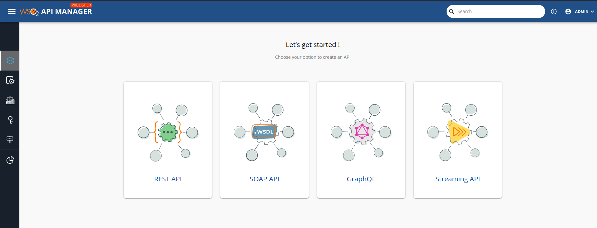. You have to click in the first one because we want to import an Open API to play with it.

Select the "Import Open Api" option 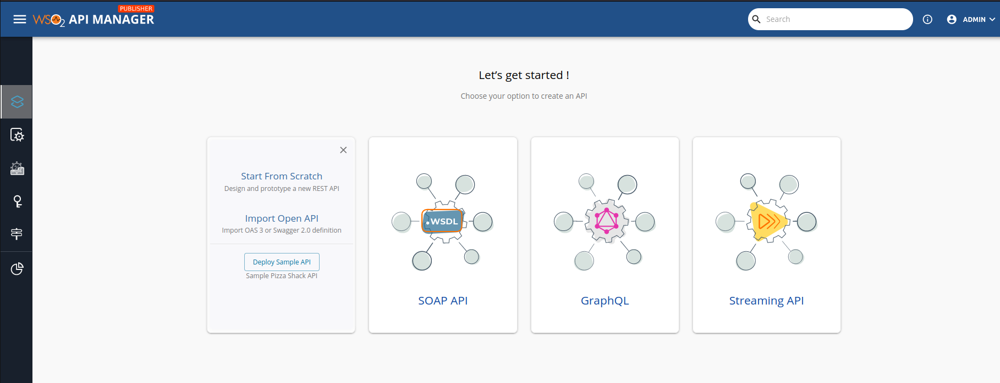

Once we selected the previous option, we need to import our swagger specification. Select the option "OpenAPI File/Archive" and import the [swagger specification](./go-dogstore/swagger.yml) from our dogstore app. 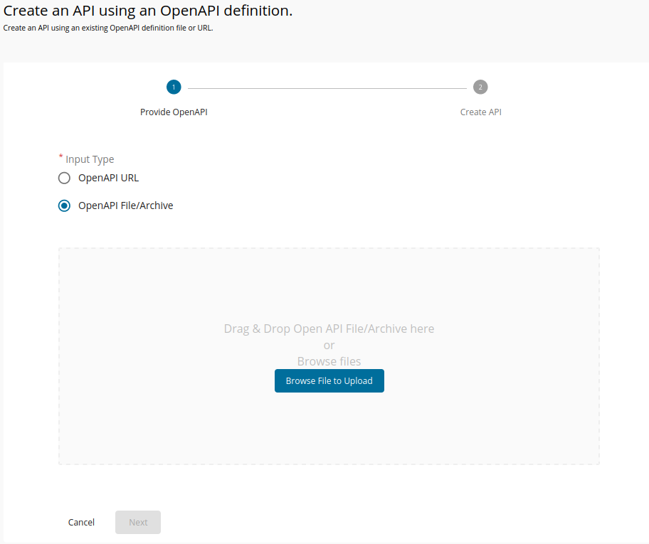

We are going to create the API in WSO2 with this parameters 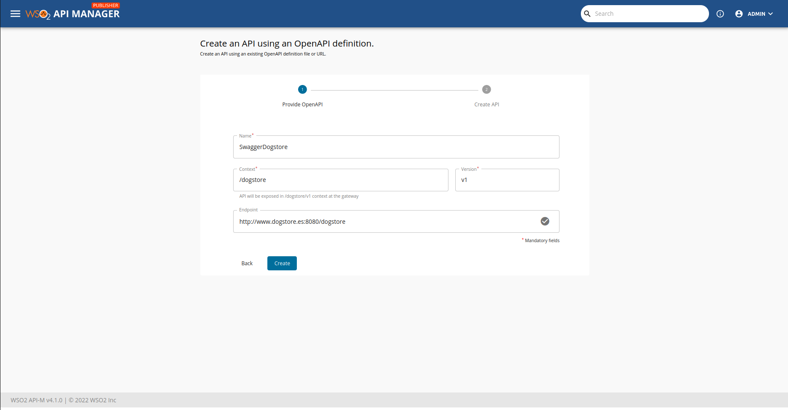

- Name: The name of your api. In this sample, this doesn't really matters.
- Context: It is the base path that all of our paths have in common in the dogstore app. In this case, is `/dogstore`.
- Version: This value will be used by WSO2 when building the final URL, eg. `http://www.dogstore.com:8080/dogstore/v1/owners`.
- Endpoint: It will be used by WSO when building the final URL also.

Once the API was created, we get to this page 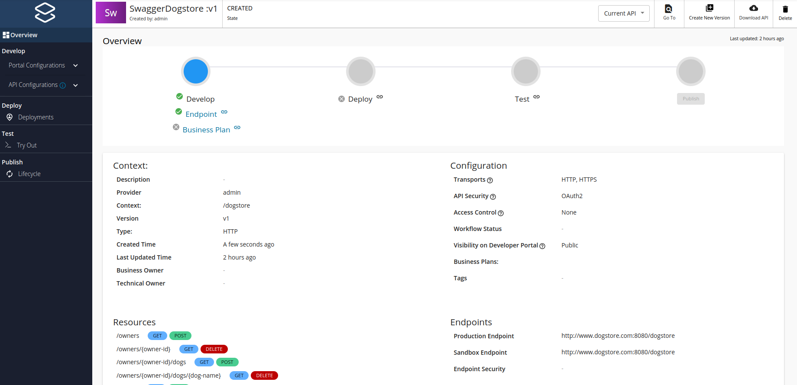

Here we can see that in the first phase we have missed the *Business Plan*, let's fix it now! Go to the left nav and select: 'Develop > Portal Configurations > Subscriptions'. We can select between 4 plans (Bronze, Gold, Silver, Unlimited). In our case, we are going to select *Bronze* and *Silver*.
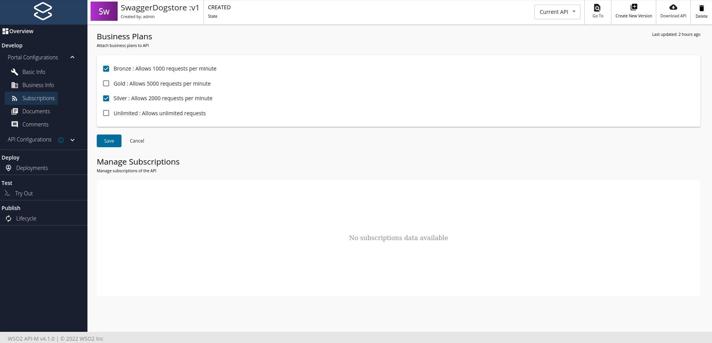

Now, we have to disable https because our application only allows http (don't try this in production environment). Go to 'Develop > API Configurations > Runtime' and deselect 'HTTPS' option. 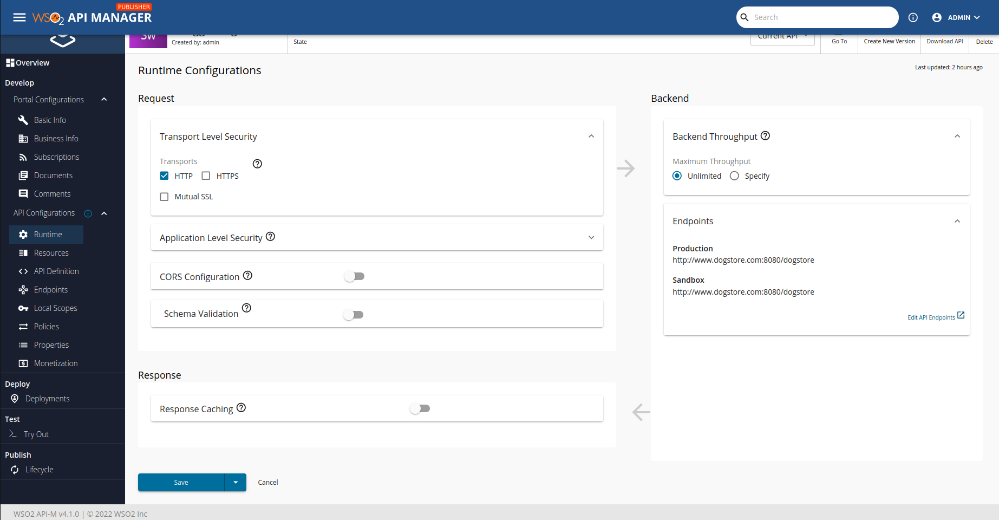

We are just running a sample app, so we can say that our app is in "production environment". We should disable the sandbox environment (dev|pre env) going to 'Develop > API Configurations > Endpoints' and unchecking "Sandbox Endpoint". 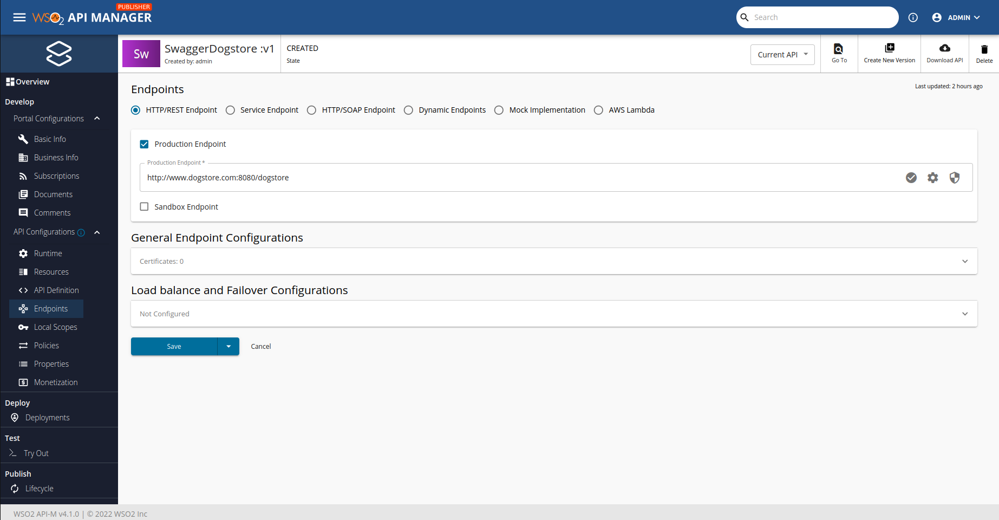

Using this GUI, we can see/edit a lot of stuff like:

- 'Develop > Portal Configurations > Basic info' section, where we can write some info about the API, like Github URL, Slack URL, or even restrict access by role.
- 'Develop > Portal Configurations > Business info' section, where we have to write information about the business owner, business owner email, etc.
- 'Develop > Portal Configurations > Documents' section, where we can write info about the API.
- 'Develop > Portal Configurations > Comments' section, where we can write just plain comments about the API.
- 'Develop > API Configurations > Resources' section, where we can see our endpoints, and modify them.
- 'Develop > API Configurations > API Defintion' section, where we can see our Swagger definition with some content being modified by WSO2 to add OAuth support.
- 'Develop > API Configurations > Local Scopes' section, where we can create roles.
- 'Develop > API Configurations > Policies' section, where we can restrict per direction of each endpoint (request, response, fault), which is quite impressive.
- 'Develop > API Configurations > Properties' section, where we can add custom properties like name, version, context...
- 'Develop > API Configurations > Monetization' section, where we talk about money jeje.

### Deploy the API

Next step is to deploy our API and test it, so we can see if it works or not. Let's go! Navigate to 'Deploy > Deployments' and click on deploy button.
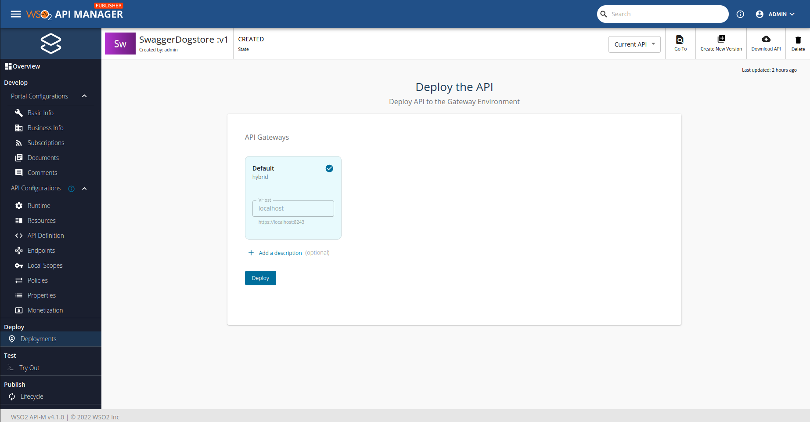

Once we have deployed the API, we should see a page like this one: 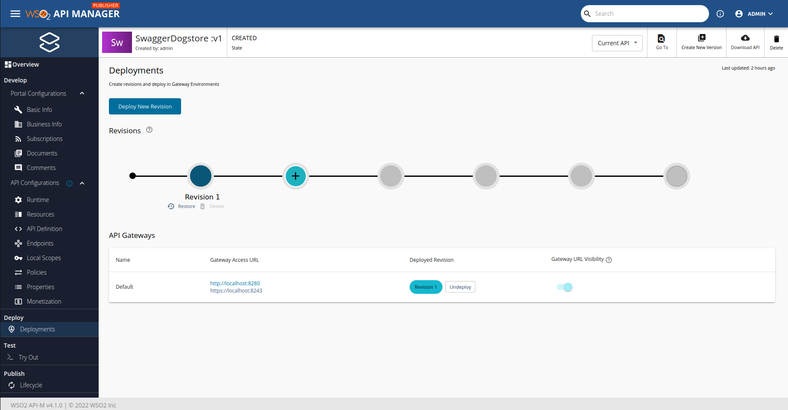

As you can see, we can't deploy more than 5 revisions at once without deleting the older ones.

### Test the API through WSO2

Time to test! Go to 'Test > Try Out' and check that you have an `Internal-Key` to use (it is the long one in the first InputText). Take that long text, go to the file [client/test.sh](./client/test.sh), and write inside the `INTERNAL_KEY`. Then execute from the same folder, `./test.sh`. You should see an output like this:

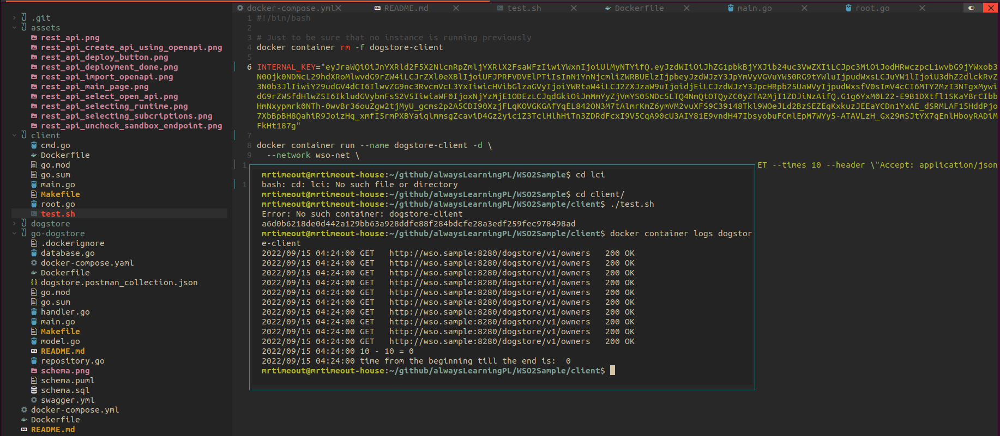

It works! We have just tested one endpoint, probably we should test all of them. Btw, if you want to tests more endpoints, you can check the [postman collection](./go-dogstore/dogstore.postman_collection.json). Remember that the port **8280**, which is the one that we are using to play with the app, is not "open to the world". So we need to get the IP address of that container using

`docker container inspect wso2sample_wso_1 --format '{{ $wso := index .NetworkSettings.Networks "wso-net" }} {{ $wso.IPAddress }}'`

or if want to use `jq`

`docker container inspect wso2sample_wso_1 --format "{{ json . }}" | jq -r '.NetworkSettings.Networks."wso-net".IPAddress'`

### Pre-release the API

The final step is to publish the API, because we have already tested that all (at least one endpoint) is working. Go to 'Publish > Lifecycle' and press *pre-release*

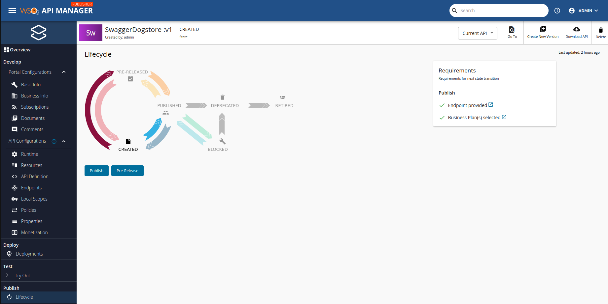

After pressing *pre-release* you will see that we have a new button at the right up corner

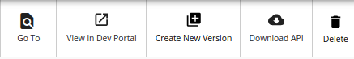

Click on 'View on Dev Portal', go to our API 'SwaggerDogstore' and click on the side nav 'Subscriptions'.

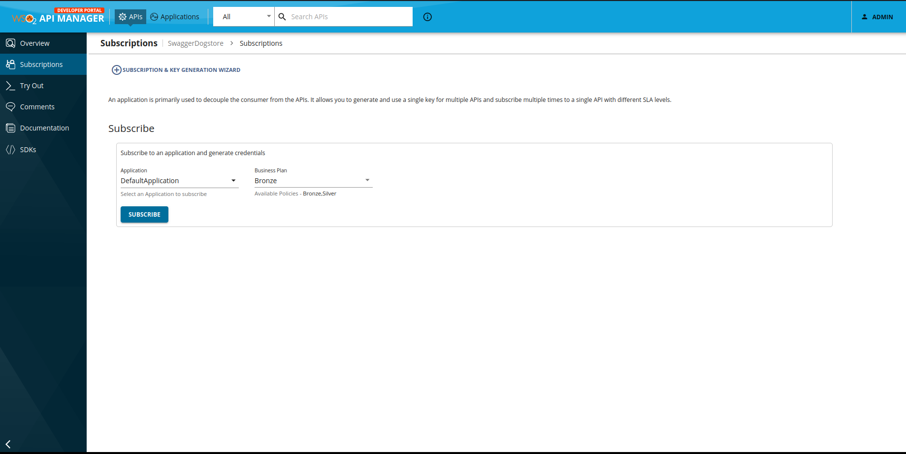

We are going to select the Bronze business plan.

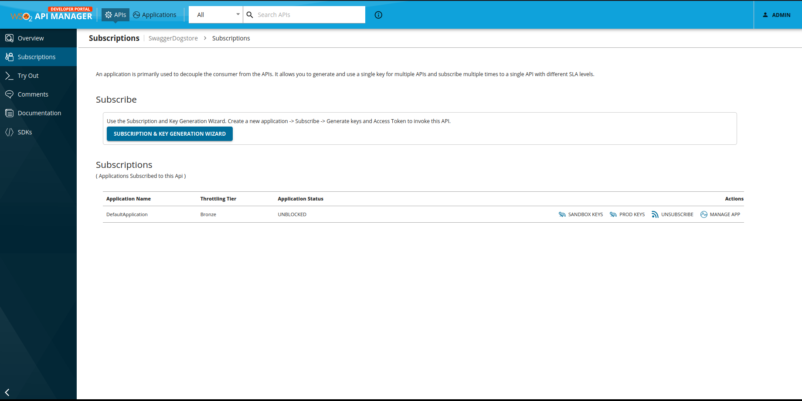

We want to generate our production keys so we can test the *pre-release* state of the API.

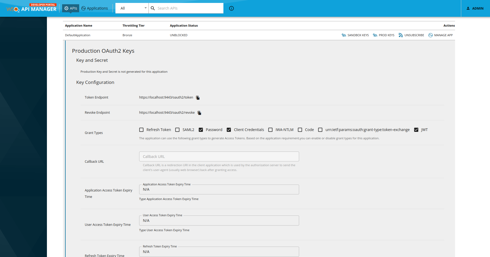

Here we can generate keys (customer key, customer secret) for a wide range of grant types:

- SAML2 (Security Assertion Markup Language)
- Password
- Client credentials
- IWA-NTLM
- Code
- urn:ietf:params:oauth:grant-type:token-exchange
- JWT

In this case, we are going to generate keys for *password* and *client credentials*, which means that we have to log in this way:

```sh
#!/bin/bash

CONSUMER_KEY=hereTheConsumerKey
CONSUMER_SECRET=hereTheConsumerSecret

basicContent=$(echo -n ${CONSUMER_KEY}:${CONSUMER_SECRET} | base64)

# password login
curl -kX POST https://localhost:9443/oauth2/token \
  --data "grant_type=password&username=admin&password=admin" \
  --header "Content-Type: application/x-www-form-urlencoded" \
  --header "Authorization: Basic ${basicContent}" \
  --insecure \
  | jq .

# credentials login
curl -kX POST https://localhost:9443/oauth2/token \
  --data "grant_type=client_credentials" \
  --header "Authorization: Basic ${basicContent}" \
  --insecure | jq .

# One liner of password login
CONSUMER_KEY=ModyX4WbEOYx_u2RfgPfrPnsJwoa; \
CONSUMER_SECRET=jO1MP8FnT9p8jfBuCyz1LfzZ1iIa; \
basicContent=$(echo -n ${CONSUMER_KEY}:${CONSUMER_SECRET} | base64); \
curl -kX POST https://localhost:9443/oauth2/token \
  --data "grant_type=password&username=admin&password=admin" \
  --header "Content-Type: application/x-www-form-urlencoded" \
  --header "Authorization: Basic ${basicContent}" \
  --insecure \
  | jq -r '.access_token'

# One liner of credentials login
CONSUMER_KEY=ModyX4WbEOYx_u2RfgPfrPnsJwoa; \
CONSUMER_SECRET=jO1MP8FnT9p8jfBuCyz1LfzZ1iIa; \
basicContent=$(echo -n ${CONSUMER_KEY}:${CONSUMER_SECRET} | base64); \
curl -kX POST https://localhost:9443/oauth2/token \
  --data "grant_type=client_credentials" \
  --header "Authorization: Basic ${basicContent}" \
  --insecure | jq -r '.access_token'
```

#### Test for password login

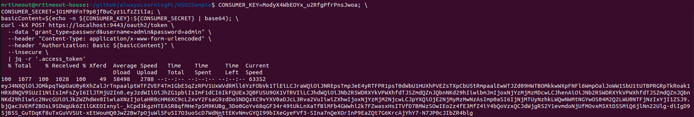

#### Test for client credentials

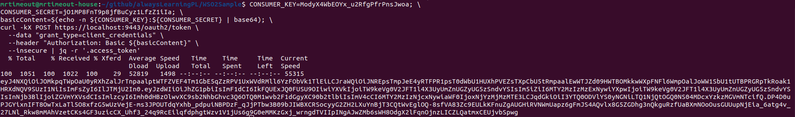

#### Testing Bronze subscription

Execute two times the script [prod.sh](./client/prod.sh) so you can see that after first 1000-1010 requests, server will response with *429 too many requests*

### Publish the API

We can finally publish the API!

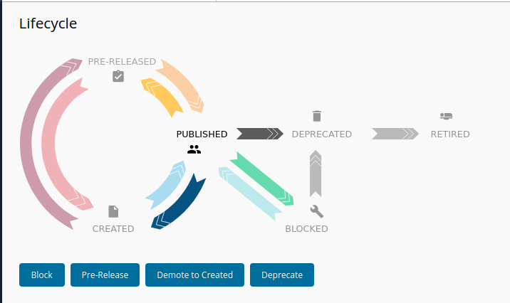

## Reference

- [docker](https://docs.docker.com/engine/install/ubuntu/)
- [docker-compose](https://docs.docker.com/engine/install/ubuntu/)
- [SAML](https://auth0.com/blog/how-saml-authentication-works/)
- [OAuth2 Grant Types](https://apim.docs.wso2.com/en/latest/design/api-security/oauth2/grant-types/overview/)

